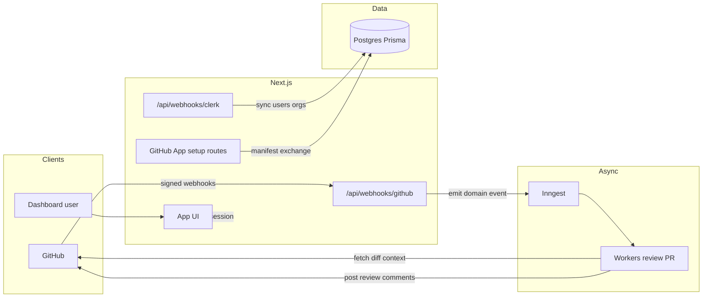

---

name: AIR implementation roadmap
overview: A phased plan to build AI Reviewer (AIR) from the current Next.js + Prisma skeleton and identity/jobs ports toward a production-shaped multi-tenant GitHub App with Clerk RBAC, Inngest-backed PR processing, and AI-generated review feedback—grounded in [AI Reviewer Notes](AI%20Reviewer%20Notes) and the code already in the repo.
todos:

- id: phase-0-hygiene
content: Standardize package manager, document env/setup (README or extend AI Reviewer Notes), verify Prisma migrate path against Supabase URLs
status: pending
- id: phase-1-clerk
content: Wire ClerkProvider, middleware with IdentityPort handshake handling, Clerk webhook → Prisma user/org sync, minimal protected dashboard
status: pending
- id: phase-2-github-app
content: GitHub App manifest + callback; persist Organization.githubInstallationId; define Clerk↔GitHub org linking model; local webhook tunnel docs
status: pending
- id: phase-3-webhooks-inngest
content: Signed GitHub webhook route; emit air/github.pull_request.enqueued with idempotency; Inngest serve route + handler; optional repo sync from GitHub API
status: pending
- id: phase-4-rbac
content: Central authorization from OrganizationRole + RepositoryScope; guard dashboard/server actions; document superuser vs org roles
status: pending
- id: phase-5-ai
content: AiReviewPort + provider; PR context assembly; post review to GitHub; failure/retry policy and minimal repo-level AI settings in schema
status: pending
- id: phase-6-dashboard
content: Org/repo settings UI, PR/review history surfacing, member/role management aligned with Clerk
status: pending
- id: phase-7-hardening
content: Tests for webhooks/RBAC, CI pipeline, observability and security review (tokens, permissions, logging)
status: pending
isProject: false

---

# AIR detailed implementation plan

## Decisions locked in

- **Clerk usage**: Clerk is used heavily for speed, but stays behind `IdentityPort` so it remains swappable.
- **Customer admins**: do **not** access the Clerk dashboard; Clerk is internal/transparent to end users.
- **Membership onboarding**: **invite-only**; employees join via a **dedicated invite link**.
- **Membership system of record**: **Clerk Organizations**; AIR mirrors into its DB for authorization, billing, and audit.
- **Roles/privileges**: AIR defines a **fixed** role list and privilege matrix (SuperUser, CustomerAdmin, TeamLead, Developer). Customers cannot define roles.
- **Metering**: token usage is the primary quota/billing metric (not PR count).

## Sources of truth

- **Product / architecture intent:** [AI Reviewer Notes](AI%20Reviewer%20Notes) — multi-tenant GitHub App (org-level install, Option B), Clerk org RBAC, Supabase Postgres + Prisma, Inngest for async AI work, webhook-driven `pull_request` flow.
- **Current code:** Next.js App Router app, [prisma/schema.prisma](prisma/schema.prisma), [src/lib/prisma.ts](src/lib/prisma.ts), placeholder [src/app/page.tsx](src/app/page.tsx), and **started but unwired** boundaries: [src/lib/identity/](src/lib/identity/) (`IdentityPort` + `ClerkIdentityAdapter` + [src/lib/identity/server.ts](src/lib/identity/server.ts)), [src/lib/jobs/](src/lib/jobs/) (`JobsPort` + `InngestJobsAdapter` + [src/lib/jobs/domain-events.ts](src/lib/jobs/domain-events.ts) including `air/github.pull_request.enqueued`).

There is no implementation code intentionally — the repo is in a planning-first state.

## Target architecture (end state)

**Boundaries already sketched (keep and extend):** dashboard and domain code should depend on `IdentityPort` / `JobsPort`, not raw Clerk/Inngest SDKs, so swapping providers or queues stays localized.

---

## Phase 0 — Project hygiene and environments

- **Keep docs current**: business plan, architecture, and roadmap must be reviewable before writing code.
- When implementation restarts: standardize package manager and environment setup in `README.md`.

**Exit criteria:** Fresh clone can install, migrate, and run `dev` with empty DB.

---

## Phase 1 — Clerk dashboard shell (identity wired end-to-end)

**Goal:** Clerk-backed auth + Clerk Organizations membership with invite-only onboarding, mirrored into AIR DB, while keeping AIR’s role/privilege model fixed and enforced by AIR.

- **Server-only Clerk admin API use**: customer admins never see Clerk; AIR server calls Clerk APIs.
- Implement **invite-only onboarding**:
  - AIR UI for Customer Admin to invite an employee by email and assign AIR role.
  - AIR server creates a Clerk organization invitation (redirect back to AIR).
- **Clerk webhooks**: mirror membership events into AIR DB:
  - `User` upsert by `clerkUserId`.
  - `Organization` upsert by `clerkOrganizationId`.
  - `OrganizationMember` upsert with AIR role.

**Exit criteria:** Sign-in, org switch, and DB rows stay in sync for test users; webhook signature failures return 400.

---

## Phase 2 — GitHub App lifecycle (manifest + installation mapping)

**Goal:** Persist `installation_id` → [Organization](prisma/schema.prisma) per [AI Reviewer Notes](AI%20Reviewer%20Notes).

- Implement **GitHub App manifest** flow: public URL that serves manifest JSON (or build-time config), **callback** route that exchanges `code` for `installation_id` + tokens per GitHub docs, then **upsert** `Organization` (`githubInstallationId` unique).
- **Linking model** (critical design choice—document in code comments):
  - **A)** One Clerk org ↔ one GitHub installation (recommended for clarity): after GitHub install, admin associates Clerk org id in UI or via webhook metadata.
  - **B)** GitHub org created first, Clerk linked later—requires merge rules to avoid duplicate `Organization` rows.
- Store **installation access token** strategy: short-lived tokens via GitHub API when needed vs encrypted storage—prefer **on-demand** token creation in workers using the installation id + private key to reduce secrets in DB.
- Local dev: **smee.io** or **ngrok** → webhook URL documented in README.

**Exit criteria:** Installing the app on a test GitHub org creates/updates `Organization` and is reproducible from a clean DB.

---

## Phase 3 — GitHub webhooks → Inngest (vertical slice, no AI yet)

**Goal:** Signed `pull_request` webhooks enqueue durable work via [JobsPort](src/lib/jobs/jobs-port.ts).

- Add `POST` handler e.g. [src/app/api/webhooks/github/route.ts](src/app/api/webhooks/github/route.ts): verify `X-Hub-Signature-256` with `GITHUB_WEBHOOK_SECRET`; parse payload; **idempotency** using `X-GitHub-Delivery` as `AirDomainEvent` `id` when emitting `air/github.pull_request.enqueued` (aligns with [domain-events.ts](src/lib/jobs/domain-events.ts)).
- Extend payload type in `AirDomainEventPayload` as needed (at minimum: installation id, repo full name, PR number, action).
- **Inngest serve route** (App Router): `GET/POST/PUT` handler per Inngest Next.js docs, exporting `inngest` client + **functions** array.
- First function: handler for `air/github.pull_request.enqueued` that logs, validates installation belongs to a known `Organization`, and optionally **syncs** [Repository](prisma/schema.prisma) metadata from GitHub API (still no AI).
- Optional: `air/test.ping` function for smoke tests.

**Exit criteria:** Opening/updating a PR on a wired repo produces one Inngest run per delivery; replays are safe with idempotent DB writes.

---

## Phase 4 — RBAC model in application code

**Goal:** Encode roles from the brief (fixed list; AIR-controlled): SuperUser, CustomerAdmin, TeamLead, Developer—plus per-repo scopes—enforced in AIR code/DB.

- Central **authorization module** (pure functions + small DB queries): given `userId`, `organizationId`, optional `repositoryId`, return allowed actions (e.g. `configure_ai_rules`, `view_feedback`, `manage_members`, `billing`).
- Rules from notes:
  - **ADMIN:** implicit access to all repos in org; can manage members and roles.
  - **TEAM_LEAD:** `RepositoryScope.canConfigure` for repos they configure; may view/configure only scoped repos unless you grant org-wide read.
  - **DEVELOPER:** visibility/interaction limited by `RepositoryScope` when present; clarify “optional scopes” vs “all repos if no rows.”
  - **isSuperuser:** platform operations only—guard with explicit checks on admin routes.
- Apply guards to **dashboard API routes** and future **mutations** (do not rely on UI hiding alone).

**Exit criteria:** Matrix of roles × actions covered by tests or a documented checklist; 403 on forbidden API calls.

---

## Phase 5 — AI review pipeline (core product)

**Goal:** On eligible PR events, generate review text and post back to GitHub.

- **Trigger policy:** which `pull_request` actions (opened, synchronize, ready_for_review, reopened) and ignore drafts/bots if desired—configurable per org/repo later; start with a conservative default.
- **Context assembly job:** fetch files/diff via GitHub APIs (respect rate limits; chunk large PRs); respect org/repo **opt-in** flags (new columns on `Repository` or a `RepoAiSettings` model: strictness, max files, excluded paths).
- **AI provider:** not fixed in repo yet—choose one (OpenAI, Anthropic, etc.), add env vars, and wrap behind an `AiReviewPort` (same pattern as identity/jobs) so the model and prompts are swappable.
- **Token metering (first-class):** every AI call records token usage with enough metadata to attribute cost to org/user/repo/run:
  - `provider`, `model`, `inputTokens`, `outputTokens`, `totalTokens`
  - `organizationId`, `userId`, `repositoryId`, PR identifiers, and job/run correlation id
  - optional `costUsd` (derived from model pricing) for dashboards later
- **Output:** GitHub review comments or a single review body—define UX (inline vs summary) in a short spec; implement minimal viable **summary review** first, then iterate to inline comments if needed.
- **Failure handling:** Inngest retries, dead-letter behavior, and user-visible error state (optional table or Inngest run URL in dashboard).

**Exit criteria:** Demo PR receives an AI-generated review comment on a private test repo with correct installation auth.

---

## Phase 6 — Dashboard product surface

- **Org home:** installation status, linked Clerk org, repo list with enable/disable AI and “strictness” for team leads/admins.
- **PR activity:** list recent Inngest runs / review outcomes (data from new tables or denormalized summaries—add `PullRequestReview` or `ReviewRun` model when you outgrow logs-only).
- **Member management:** invite/remove, role changes (Clerk vs DB source of truth—prefer Clerk for membership if using Clerk Organizations, and mirror roles into `OrganizationMember` for app-specific TEAM_LEAD/DEV semantics).

**Exit criteria:** Non-developer stakeholders can complete install + configure without touching the database.

---

## Phase 7 — Hardening

- **Observability:** structured logs for webhook and worker steps; correlation ids (`deliveryId`, PR id).
- **Security:** rotate webhook secrets; least-privilege GitHub App permissions; never log tokens; validate GitHub event repository matches `Organization` installation.
- **Testing:** unit tests for signature verification and RBAC; integration tests with recorded payloads or GitHub fixtures.
- **CI:** lint, typecheck, `prisma validate`, optional migration check on PRs.

---

## Schema / domain gaps to resolve during implementation

The current Prisma models are a strong backbone but the brief implies features you will likely add:

- **Billing** (Admin): no tables yet—defer or add `OrganizationBilling` stub if scope includes Stripe.
- **Usage metering**: add a usage ledger/event table for token accounting and quota enforcement.
- **AI rules / strictness:** either columns on `Repository` or normalized `AiPolicy` / `RepoAiSettings`.
- **PR / review history:** optional `ReviewRun` for dashboard and deduplication beyond GitHub delivery id.
- **GitHub ↔ Clerk org linking:** explicit nullable fields or join table to avoid ambiguous duplicates.

---

## Suggested implementation order (summary)

1. Phase 0–1: runnable app + Clerk + user/org sync.
2. Phase 2: GitHub App manifest + `Organization` persistence + linking story.
3. Phase 3: GitHub webhook + Inngest slice (sync repo metadata).
4. Phase 4: RBAC enforcement before exposing dangerous settings.
5. Phase 5: AI pipeline + GitHub posting.
6. Phase 6–7: dashboard depth, polish, CI, and security.

This order matches the brief’s “webhook → Inngest” spine while keeping RBAC in place before AI and org-wide settings go live.