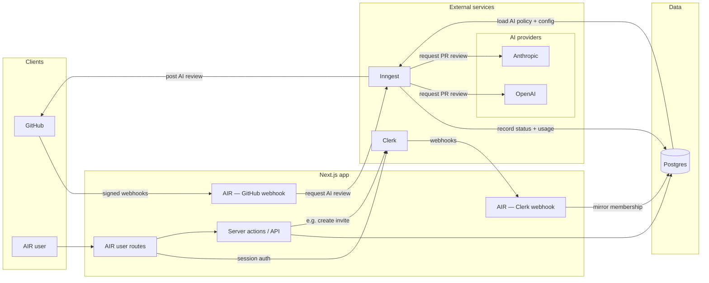
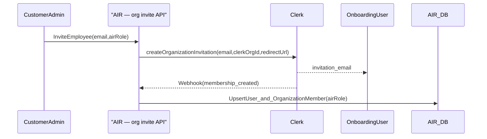
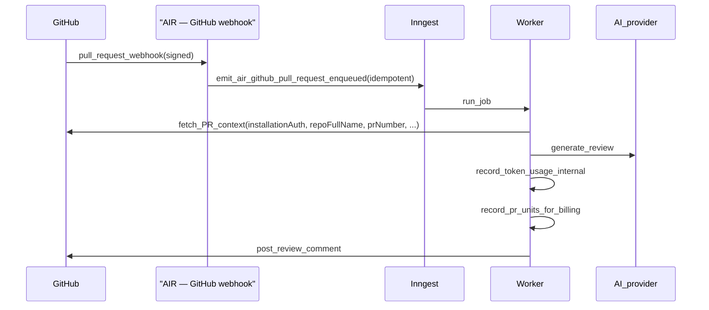

# AIR (AI Reviewer) — system architecture (draft)

## High-level architecture

AIR is a multi-tenant GitHub App with a Next.js web UI and webhook endpoints, a Postgres database (via Prisma), and an async worker pipeline (Inngest) that performs AI review work.

The diagram below is a fenced **Mermaid** code block. **GitHub** renders these natively when you view the Markdown file on the website. **Cursor’s** built-in Markdown preview also renders Mermaid, but the engine, default theme, and **click-through for links** can differ from GitHub (relative links in the preview are often inert compared to github.com’s file view).

**Postgres ↔ Inngest:** The diagram labels those two links on github.com. Some **local** Markdown previews still draw the labels offset from the curves; if yours looks wrong, rely on the diagram notes below (same meaning).

### Diagram notes (read with the figure)

- **AIR user** means any human using the AIR product in a **signed-in session**, regardless of AIR role (**SuperUser**, **Customer Admin**, **Team Lead**, **Developer**). That is separate from **GitHub**, which is the other “client” (the platform calling your webhook and receiving review posts).
- **AIR user routes** are the Next.js pages and handlers meant for **people** (dashboard, settings, member flows, etc.), as opposed to the **webhook** routes that accept signed calls from GitHub or Clerk without a browser session. In the figure, **WH** is **AIR — GitHub webhook** and **CW** is **AIR — Clerk webhook** (same names as in the sequence diagrams below).
- **Server actions / API** is **not** invite-only. The edge labeled **e.g. create invite** is one **representative** server-side call into Clerk via `IdentityPort`; the same surface would also cover org/repo settings, RBAC-guarded reads/writes, metering hooks, and other mutations—the diagram omits extra arrows to stay readable.
- **GitHub webhook → Inngest (`request AI review`)** names the **product intent** of the main spine: after a verified `pull_request` (and similar) webhook, AIR should **enqueue durable work** so workers can assemble context, call the AI provider, and post review feedback back to GitHub. Transport-wise that is still an **emitted domain event / job** (for example the roadmap’s `air/github.pull_request.enqueued`), not a literal synchronous “request” to Inngest’s UI.
- **Postgres → Inngest (`load AI policy + config`)** — Reads from Postgres to support the job—resolve **`Organization`** from `installation_id`; load **`Repository`** / AI policy (strictness, path excludes, enabled flag); read **dedupe / prior run** rows by delivery or PR identity; optionally load **`OrganizationMember`** for attribution. The diagram labels this on the **Postgres → Inngest** arrow (declared second so it tends not to overlap the write label in Mermaid).
- **Inngest → Postgres (`record status + usage`)** — Writes and durable updates—**`ReviewRun`** (or equivalent) status transitions; append **internal token-usage** per model call; append **PR-unit billing** events on completion; upsert **repo metadata** from GitHub; store **errors / correlation ids** for the dashboard. The diagram labels this on the **Inngest → Postgres** arrow. (Exact table names evolve with Prisma—this is the intent.)
- **Inngest → AI providers (`request PR review`)** — AIR may support **multiple model vendors** (the diagram shows **OpenAI** and **Anthropic** as examples—others plug in via `AiReviewPort`). The label means **your worker calls the vendor HTTP API** (e.g. chat-completions): **system** message = reviewer rules; **user** message = PR bundle (title, description, files, diff hunks or summaries); optional **follow-up** calls for a shorter summary or **JSON-shaped** findings before posting to GitHub; each call returns **text + token counts** for the usage ledgers above.

## Key domain concepts

- **Organization (customer company)**: maps to both a GitHub installation and a Clerk Organization.
- **Membership**: system-of-record in Clerk; mirrored to AIR DB for authorization and billing.
- **AIR roles**: fixed list (SuperUser, CustomerAdmin, TeamLead, Developer) enforced by AIR.
- **Billing usage**: PR-unit ledger used for trial/limits/billing.
- **Internal cost and sizing**: token usage ledger used for cost monitoring and PR sizing.
- **Clerk ↔ GitHub org linking (locked commitment, roadmap Option A):** one **Clerk Organization** maps to **exactly one** GitHub App **installation** for that customer company. AIR encodes this 1:1 rule so `Organization` rows, onboarding, and webhooks stay unambiguous; many-to-many or “install first, reconcile duplicates later” models are **out of scope** for the MVP architecture.

### Customer onboarding: GitHub install vs Clerk org (order)

The **business plan** emphasizes **GitHub App installation** early in “company onboarding,” while this document’s **identity** sections emphasize **Clerk Organizations** and **invites**. Both are correct at the product level: real customers may complete steps in **either order** (Clerk org and users first, or GitHub install first). AIR must support a clear **linking** moment—UI or automated step—that binds the **one** Clerk org to the **one** installation per Option A, regardless of which side existed first. Empty states (“installed on GitHub but not linked in AIR”) are normal until that step completes; the architecture assumes **idempotent** linking writes, not duplicate `Organization` rows.

## GitHub webhook responsiveness and queueing

- After **signature verification** (and minimal durable bookkeeping such as idempotency keys), the **AIR — GitHub webhook** handler (the Next.js route for signed GitHub webhooks; same node **WH** in the overview diagram) must return **`2xx`** quickly. Heavy work runs in **Inngest workers** invoked via `JobsPort` / domain events (for example `air/github.pull_request.enqueued`). Slow or non-`2xx` responses cause **GitHub retries**, which can amplify load and duplicate edge traffic.
- The high-level diagram already shows **webhook → Inngest**; the **fast `2xx` + enqueue** contract is documented **in this section only** (prose). The diagram **intentionally omits** HTTP timing and status-code detail so the figure stays readable.

## Quota enforcement and visibility

- **Primary check (GitHub webhook handler):** when AIR can already determine that the **customer’s quota is exhausted**, **do not enqueue** the **full AI review** pipeline (no provider spend). Instead **enqueue a lightweight durable job** whose purpose is to record a **terminal `quota_exceeded` / over-quota** outcome (and any fields the dashboard needs), still via `JobsPort` / Inngest so the result is **traceable** like other runs. Always return **`2xx`** to GitHub when the payload was authentic and handled, so GitHub does not treat the delivery as a transport failure worth aggressive retry.
- **Secondary check (worker, before AI spend):** on the **happy-path** review job, perform a **final quota check or atomic reservation** immediately **before** calling the AI provider (and before material token spend). Concurrent webhooks can pass the primary check under race; the second gate prevents **overshooting** quota.
- **Who sees failures:** GitHub’s **delivery log** (for people with repo/org admin access to the app installation) shows HTTP status and sometimes a short response body; it does **not** replace product UX. **Developers, Team Leads, and Customer Admins** should see quota and review outcomes in the **AIR dashboard** (and any future notifications), not by relying on GitHub showing “webhook failed” on the PR itself.

## Identity and membership flow (invite-only)

### What “joins the company in AIR” means

In the business plan that phrase is shorthand for **two related outcomes** that must happen together when an invite completes:

1. **Organization membership** — The person is a member of the **customer’s tenant** in the identity system (today: a **Clerk Organization**). That answers: *“Which company does this user belong to for login and multi-tenant isolation?”* Until this exists, they should not see that company’s AIR data.
2. **Assigned AIR role** — The same person has an **application permission tier** for that tenant: Customer Admin, Team Lead, or Developer (see business plan). That answers: *“What are they allowed to do inside AIR for that company?”* (invite others, change AI rules, view PR feedback, etc.). This is **AIR-specific**; Clerk’s org roles are not assumed to match AIR’s role names one-to-one, so AIR stores the chosen role (e.g. on `OrganizationMember`) and enforces it in app code.

**Why two bullets instead of one:** Membership alone does not define privileges. Role alone is meaningless without membership in the right org. “Joins the company in AIR” means **both**: they are in the **right org** and AIR has recorded the **right role** for them (typically after Clerk confirms membership and AIR’s webhook/sync updates the DB).

**OnboardingUser** is the **invited employee** (the address on the invitation), distinct from **CustomerAdmin**, who initiated the invite. Clerk sends the invitation email to the invitee; AIR may also notify the admin in the product UI, which this diagram omits.

The diagram’s `UpsertUser_and_OrganizationMember(airRole)` step is intentionally doing **both**: mirror the user, ensure **org membership** in AIR’s DB, and persist `airRole` for authorization and billing attribution.

**Clerk webhook ordering:** the sequence diagram is a **logical** story, not a guaranteed real-time order. **Invitation created**, **invitation accepted**, **membership created/updated**, and **membership removed** events can arrive **asynchronously** and in different orders than the UI narrative. Webhook handlers should use **idempotent upserts** keyed on stable Clerk identifiers so repeated or out-of-order deliveries converge to the same DB state.

## Webhook → async pipeline (GitHub PR review)

The **`fetch_PR_context(...)`** arrow is intentionally **short**: the worker calls GitHub’s APIs with **installation auth** plus **PR identity** (`repoFullName`, `prNumber`) and whatever else the implementation needs (base/head SHAs, pagination, file list, diff options, rate-limit state, etc.)—not a single-parameter function in real code.

## Port-and-adapter boundaries (for provider swaps)

- **`IdentityPort`**: hides Clerk SDK details behind an internal interface used by server code.
- **`JobsPort`**: hides Inngest behind an internal interface used by webhook handlers/domain logic.
- **Usage/billing abstractions**:
  - a small interface for recording **PR-unit billing events**
  - a small interface for recording **internal token cost events**
  This keeps monetization logic stable even as AI providers/models change.

## Domain events (internal names for async work)

AIR uses **domain events** as **stable string names plus a payload** for “something happened that should trigger **durable, asynchronous** processing.” They are **not** HTTP routes, **not** REST paths, and **not** a catalog of API error codes. Examples: `air/github.pull_request.enqueued`, `air/github.pull_request.quota_exceeded` (or a single event type with a `reason` field—either pattern is valid).

- **Emit / publish:** In practice the same idea here—after the webhook route verifies the request, **`JobsPort`** (or equivalent) **emits** the event to **Inngest**, which persists it and schedules work. That is **queue-like**: the HTTP handler can return **`2xx`** quickly while the event waits for a worker.
- **Consumers:** Inngest can run **one or more functions** registered for the **same** event name if the product needs parallel reactions (each function is its own “consumer”). Alternatively, **one** function handles the event and branches internally—simpler for early MVP.
- **Logging / metrics:** Treat these as **side effects at emit time or inside handlers** (structured logs with correlation ids). They are usually **not** separate subscribers reading the same queue message unless you later introduce a **fan-out bus** (for example Kafka, SNS) where many services subscribe—out of scope until needed.

## Security considerations (MVP)

- Verify GitHub webhooks (HMAC signature) and Clerk webhooks (signature verification).
- Treat all external identifiers as untrusted input; validate installation/org mappings.
- Never log tokens/keys; minimize secret storage. For GitHub API calls, prefer **on-demand installation access tokens**: the app proves itself with its **private key**, GitHub mints a **short-lived token** for the **installation** (the org/repo scope where the app is installed); avoid persisting long-lived installation tokens in Postgres when the GitHub API pattern suffices.
- **SuperUser (AIRC operator) surfaces:** harden against **both** (a) **unauthenticated** or internet-wide abuse and (b) **authenticated customer roles** (e.g. Developer) **never** invoking vendor-operator routes—authorization must be enforced on every server entrypoint, not only hidden UI. In the usual **hosted** shape, SuperUser HTTP routes live on the **same public `https` deployment** as the rest of AIR; they are **not** “off the public internet,” they are **useless without SuperUser authentication and authorization** (and optional extra controls later, such as IP allowlists or a separate admin deployment, if AIRC ever needs them).
- **GitHub `installation_id` vs secrets:** the numeric **`installation_id`** GitHub associates with an app install is a **stable identifier** used in webhooks and DB rows; treat it as **opaque and validated**, but do **not** confuse it with a **credential**. What must stay **secret** is the **GitHub App private key** (and **webhook secret**, OAuth client secret if used, etc.). Short-lived **installation access tokens** are derived from the private key and should not be logged or stored long-term when avoidable.
- **When AIR uses installation access tokens:** any GitHub API call that acts **as the installed app**, not only posting the review—for example **fetching PR metadata and diffs**, **listing repositories**, **syncing repo metadata** for the dashboard or workers, **posting review comments**, and **other** permitted app operations you add later. Inngest workers typically need tokens for **read context** and **write review**, not only the final post.
- **Observability without leaking customer data:** structured logs should carry **correlation identifiers** so operators can **join logs to Postgres rows** during support—for example the **`X-GitHub-Delivery`** header (**set by GitHub** on each webhook POST; AIR reads it and may persist it for idempotency), Inngest run id, `organizationId`, `repositoryId`, PR number. That is **not** a substitute for logging secrets or full diffs: avoid **PII** and **customer-confidential payload** (file contents, large hunks) in log streams; keep those in the database or bounded internal tools.

## Customer data: webhooks, Postgres, Inngest (DPA-oriented)

This section is **engineering guidance**, not legal advice. Final DPA posture needs counsel and each vendor’s **DPA** / **subprocessor** list.

- **What GitHub sends on `pull_request`:** the JSON payload is mostly **metadata** (repository identity, PR number, refs, title, description text, author handles, URLs, labels, merge state). It usually does **not** contain the **full repository** or a complete diff of all files, but the **title and body can still hold secrets** if someone pasted them, and some payloads can include **small patch excerpts** depending on event type and options—so treat webhooks as **potentially confidential**, not “metadata only.”
- **Where the bulk of code lives:** workers typically **fetch** diffs and file contents from **GitHub’s API** using an installation token **after** the job starts. That fetch path is another **subprocessor** surface (GitHub) alongside AIR’s own DB, Inngest, and the AI vendor.
- **Postgres:** prefer storing **references and outcomes** (installation id, repo, PR number, delivery id, run status, timestamps, error codes, **short** excerpts if truly needed for UX) rather than **full diffs or file trees** unless the product explicitly requires it. Anything you persist needs **retention**, access control, and customer transparency in line with your **customer-facing DPA** and privacy policy.
- **Inngest:** persists the **event payload** you send when you emit an event (and related run metadata) for **delivery, retries, and observability**—see Inngest’s own documentation for **data retention** and **DPA**. **Minimize** what you put in the event body: prefer **identifiers** (`installation_id`, repo full name, PR number, `X-GitHub-Delivery`) so the worker loads sensitive context from GitHub **inside** the function, instead of copying large diffs into the event. Less payload in Inngest reduces duplicate copies of customer code across systems.
- **Agreed implementation default:** GitHub-driven **domain events** carry **identifiers only**; workers **fetch** diff/file context from the GitHub API **in memory** for assembly and AI calls; **Postgres** stores **references, status, metering, and short errors**—not full diffs—unless a later product requirement forces it with explicit retention and customer disclosure. The [implementation roadmap](air-implementation-roadmap.md) **Phase 3** (and later phases) should follow this section; the roadmap repeats only **task-level** reminders and links here for rationale.
- **Chain of processing:** customer confidential content may flow **GitHub → AIR webhook (transient) → Inngest (payload you choose) → worker memory → GitHub API again → AI vendor → Postgres (only if you store it)**. Each hop should be **justified, minimized, and listed** in subprocessors / privacy materials as your program matures.

## AI provider payload and vendor policy

- Inngest workers send **PR metadata and code/diff context** to model vendors over the public internet (for example **HTTPS** to vendor APIs)—data leaves AIR’s trust boundary for that request/response. **Vendor DPA** means the vendor’s **Data Processing Agreement** (contract governing how they process customer data); **terms** means their **Terms of Service** / product policies (what they may log, retain, or use for safety and product improvement).
- **Customer “no training” intent:** AIR may store a **per-customer preference** and map it to **whatever controls the chosen provider actually exposes**—for example **dedicated API keys**, **organization-level** “no training” settings, **enterprise** agreements, or **request flags** where the vendor documents them. It is **not** universally true that every model API accepts a per-request “do not train on this payload” switch controlled by Inngest; implementation must follow **each provider’s current API and compliance model**, and product copy should avoid promising a mechanism the vendor does not offer.

## Architecture review — agreed decisions (items 1–8)

The following items were discussed and **locked for this draft**; detail lives in the sections above.

1. **GitHub webhook `2xx` + queueing** — Verify signature and minimal bookkeeping, return **`2xx` quickly**, run heavy work in Inngest; this **contract is prose-only** (not drawn on the Mermaid overview diagram).
2. **Quota** — **Primary:** at webhook, if quota exceeded, skip the **full AI** enqueue but **enqueue a lightweight over-quota job**, still return **`2xx`** to GitHub. **Secondary:** on the happy-path job, final quota check or reservation **immediately before** AI spend to close races. **Visibility:** quota and outcomes in **AIR**, not as a substitute via GitHub PR UI.
3. **SuperUser** — Guard **unauthenticated abuse** and **customer-role escalation**; SuperUser routes remain on the **same public `https` app** but are unusable without **SuperUser** auth.
4. **GitHub installation access** — **`installation_id`** is an identifier, not the primary secret; protect **private key** / webhook secret. Tokens are minted **on demand** for **all** GitHub-as-app API use (fetch PR, post review, sync metadata, etc.), not only posting the review.
5. **Clerk ↔ GitHub linking** — **Option A** (one Clerk org ↔ one installation) is recorded under **Key domain concepts**.
6. **AI vendor data** — PR context leaves AIR over **HTTPS**; retention / training / DPA governed by **vendor + account**; customer preference maps to **real** provider controls.
7. **Logging** — Correlation via **opaque handles** (including **`X-GitHub-Delivery`** from GitHub); **no** secrets, full diffs, or unnecessary PII in log streams.
8. **Data minimization (events, workers, Postgres)** — **Identifiers** in domain event payloads; **fetch** code from GitHub **in worker memory**; **minimal** durable Postgres state—see **§ Customer data: webhooks, Postgres, Inngest**; [roadmap](air-implementation-roadmap.md) Phase 3 links here for tasks.

### Follow-on review topics (captured in this document)

- **Invite / Clerk webhooks:** asynchronous ordering and **idempotent upserts** (see **Identity and membership flow**).
- **Onboarding order:** GitHub-first vs Clerk-first both allowed; **linking** reconciles to Option A (subsection **Customer onboarding: GitHub install vs Clerk org**).

