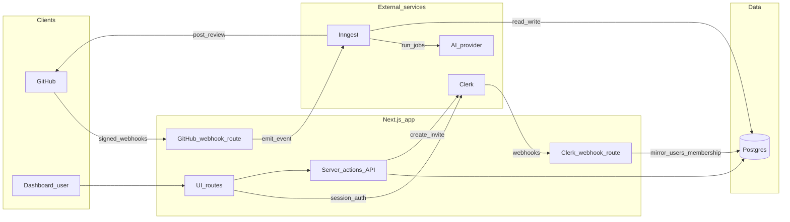
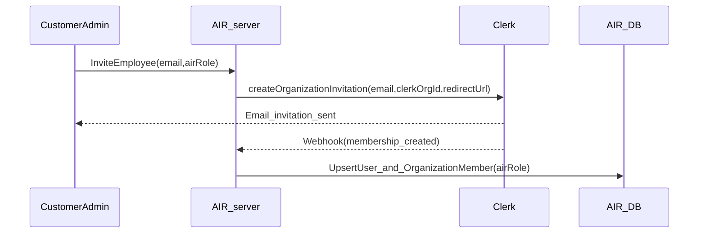
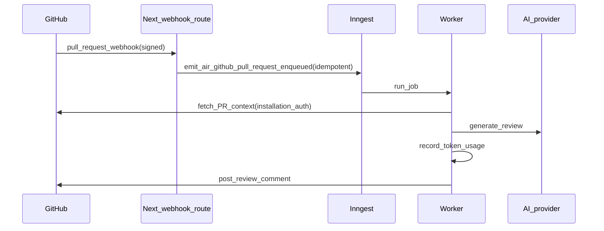

# AIR (AI Reviewer) — system architecture (draft)

## High-level architecture

AIR is a multi-tenant GitHub App with a Next.js web UI and webhook endpoints, a Postgres database (via Prisma), and an async worker pipeline (Inngest) that performs AI review work.

## Key domain concepts

- **Organization (customer company)**: maps to both a GitHub installation and a Clerk Organization.
- **Membership**: system-of-record in Clerk; mirrored to AIR DB for authorization and billing.
- **AIR roles**: fixed list (SuperUser, CustomerAdmin, TeamLead, Developer) enforced by AIR.
- **Usage**: token usage ledger used for trial/limits/billing.

## Identity and membership flow (invite-only)

## Webhook → async pipeline (GitHub PR review)

## Port-and-adapter boundaries (for provider swaps)

- **`IdentityPort`**: hides Clerk SDK details behind an internal interface used by server code.
- **`JobsPort`**: hides Inngest behind an internal interface used by webhook handlers/domain logic.
- **Usage metering abstraction**: a small interface for recording token usage events, so swapping AI providers does not require reworking billing logic.

## Security considerations (MVP)

- Verify GitHub webhooks (HMAC signature) and Clerk webhooks (signature verification).
- Treat all external identifiers as untrusted input; validate installation/org mappings.
- Never log tokens/keys; minimize secret storage (use installation auth on-demand where possible).

