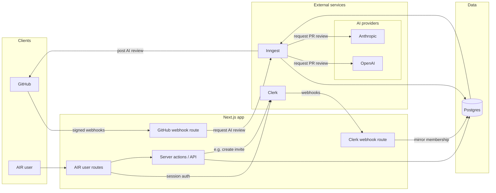
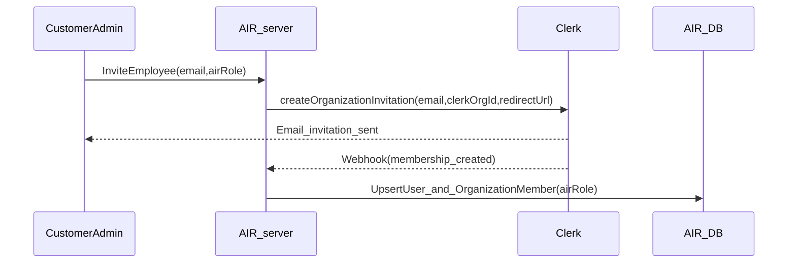
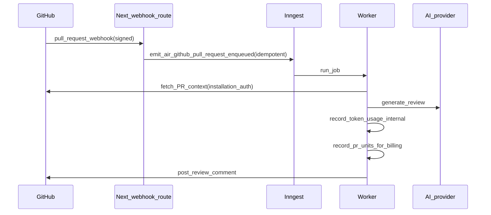

# AIR (AI Reviewer) — system architecture (draft)

## High-level architecture

AIR is a multi-tenant GitHub App with a Next.js web UI and webhook endpoints, a Postgres database (via Prisma), and an async worker pipeline (Inngest) that performs AI review work.

The diagram below is a fenced **Mermaid** code block. **GitHub** renders these natively when you view the Markdown file on the website. **Cursor’s** built-in Markdown preview also renders Mermaid, but the engine, default theme, and **click-through for links** can differ from GitHub (relative links in the preview are often inert compared to github.com’s file view).

**Postgres ↔ Inngest (the two plain arrows, no on-arrow text):** **Inngest → Postgres** = *record status + usage* (writes: run status, token usage, PR units, repo sync, errors, …). **Postgres → Inngest** = *load AI policy + config* (reads: org/install mapping, repo AI settings, dedupe / prior runs, …). Mermaid’s layout often drops edge labels *below* curved two-way links in previews, so those phrases live in this line instead of on the diagram.

### Diagram notes (read with the figure)

- **AIR user** means any human using the AIR product in a **signed-in session**, regardless of AIR role (**SuperUser**, **Customer Admin**, **Team Lead**, **Developer**). That is separate from **GitHub**, which is the other “client” (the platform calling your webhook and receiving review posts).
- **AIR user routes** are the Next.js pages and handlers meant for **people** (dashboard, settings, member flows, etc.), as opposed to the **webhook** routes that accept signed calls from GitHub or Clerk without a browser session.
- **Server actions / API** is **not** invite-only. The edge labeled **e.g. create invite** is one **representative** server-side call into Clerk via `IdentityPort`; the same surface would also cover org/repo settings, RBAC-guarded reads/writes, metering hooks, and other mutations—the diagram omits extra arrows to stay readable.
- **GitHub webhook → Inngest (`request AI review`)** names the **product intent** of the main spine: after a verified `pull_request` (and similar) webhook, AIR should **enqueue durable work** so workers can assemble context, call the AI provider, and post review feedback back to GitHub. Transport-wise that is still an **emitted domain event / job** (for example the roadmap’s `air/github.pull_request.enqueued`), not a literal synchronous “request” to Inngest’s UI.
- **Postgres → Inngest (*load AI policy + config*)** — Same meaning as the **legend line** above the diagram notes: reads from Postgres to support the job—resolve **`Organization`** from `installation_id`; load **`Repository`** / AI policy (strictness, path excludes, enabled flag); read **dedupe / prior run** rows by delivery or PR identity; optionally load **`OrganizationMember`** for attribution. The diagram shows one unlabeled arrow for all read patterns.
- **Inngest → Postgres (*record status + usage*)** — Same meaning as the legend line: writes and durable updates—**`ReviewRun`** (or equivalent) status transitions; append **internal token-usage** per model call; append **PR-unit billing** events on completion; upsert **repo metadata** from GitHub; store **errors / correlation ids** for the dashboard. The diagram shows one unlabeled arrow. (Exact table names evolve with Prisma—this is the intent.)
- **Inngest → AI providers (`request PR review`)** — AIR may support **multiple model vendors** (the diagram shows **OpenAI** and **Anthropic** as examples—others plug in via `AiReviewPort`). The label means **your worker calls the vendor HTTP API** (e.g. chat-completions): **system** message = reviewer rules; **user** message = PR bundle (title, description, files, diff hunks or summaries); optional **follow-up** calls for a shorter summary or **JSON-shaped** findings before posting to GitHub; each call returns **text + token counts** for the usage ledgers above.

## Key domain concepts

- **Organization (customer company)**: maps to both a GitHub installation and a Clerk Organization.
- **Membership**: system-of-record in Clerk; mirrored to AIR DB for authorization and billing.
- **AIR roles**: fixed list (SuperUser, CustomerAdmin, TeamLead, Developer) enforced by AIR.
- **Billing usage**: PR-unit ledger used for trial/limits/billing.
- **Internal cost and sizing**: token usage ledger used for cost monitoring and PR sizing.

## Identity and membership flow (invite-only)

### What “joins the company in AIR” means

In the business plan that phrase is shorthand for **two related outcomes** that must happen together when an invite completes:

1. **Organization membership** — The person is a member of the **customer’s tenant** in the identity system (today: a **Clerk Organization**). That answers: *“Which company does this user belong to for login and multi-tenant isolation?”* Until this exists, they should not see that company’s AIR data.
2. **Assigned AIR role** — The same person has an **application permission tier** for that tenant: Customer Admin, Team Lead, or Developer (see business plan). That answers: *“What are they allowed to do inside AIR for that company?”* (invite others, change AI rules, view PR feedback, etc.). This is **AIR-specific**; Clerk’s org roles are not assumed to match AIR’s role names one-to-one, so AIR stores the chosen role (e.g. on `OrganizationMember`) and enforces it in app code.

**Why two bullets instead of one:** Membership alone does not define privileges. Role alone is meaningless without membership in the right org. “Joins the company in AIR” means **both**: they are in the **right org** and AIR has recorded the **right role** for them (typically after Clerk confirms membership and AIR’s webhook/sync updates the DB).

The diagram’s `UpsertUser_and_OrganizationMember(airRole)` step is intentionally doing **both**: mirror the user, ensure **org membership** in AIR’s DB, and persist `**airRole`** for authorization and billing attribution.

## Webhook → async pipeline (GitHub PR review)

## Port-and-adapter boundaries (for provider swaps)

- `**IdentityPort**`: hides Clerk SDK details behind an internal interface used by server code.
- `**JobsPort**`: hides Inngest behind an internal interface used by webhook handlers/domain logic.
- **Usage/billing abstractions**:
  - a small interface for recording **PR-unit billing events**
  - a small interface for recording **internal token cost events**
  This keeps monetization logic stable even as AI providers/models change.

## Security considerations (MVP)

- Verify GitHub webhooks (HMAC signature) and Clerk webhooks (signature verification).
- Treat all external identifiers as untrusted input; validate installation/org mappings.
- Never log tokens/keys; minimize secret storage (use installation auth on-demand where possible).

